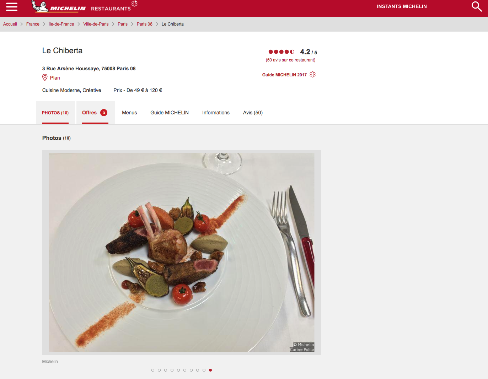
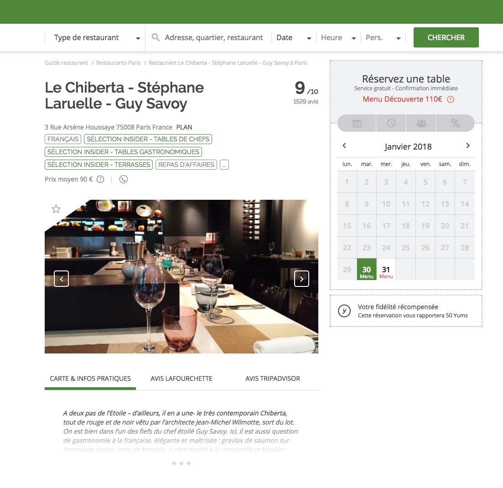

# TOP CHEF

> Eat well and cheaper than usually

<!-- START doctoc generated TOC please keep comment here to allow auto update -->
<!-- DON'T EDIT THIS SECTION, INSTEAD RE-RUN doctoc TO UPDATE -->
**Table of Contents**  *generated with [DocToc](https://github.com/thlorenz/doctoc)*

- [Introduction](#introduction)
- [Objective - Workshop in 1 sentence](#objective---workshop-in-1-sentence)
- [How to do that?](#how-to-do-that)
  - [Stack](#stack)
- [Just tell me what to do](#just-tell-me-what-to-do)
- [Examples of steps to do](#examples-of-steps-to-do)
  - [Investigation](#investigation)
    - [Michelin Restaurant](#michelin-restaurant)
    - [Deals from LaFourchette](#deals-from-lafourchette)
    - [The web application](#the-web-application)
  - [Server-side with Node.js](#server-side-with-nodejs)
    - [require('michelin')](#requiremichelin)
    - [require('lafourchette')](#requirelafourchette)
  - [Client-side with React](#client-side-with-react)
  - [Notification (bonus)](#notification-bonus)
- [Don't forget](#dont-forget)
- [Licence](#licence)

<!-- END doctoc generated TOC please keep comment here to allow auto update -->

## Introduction

Each year, Michelin publish the Michelin Red Guide which awards Michelin stars to some restaurants.

The criteria for the stars are:

1. Michelin star **"A very good restaurant in its category"** (Une très bonne table dans sa catégorie)
2. Michelin stars: **"Excellent cooking, worth a detour"** (Table excellente, mérite un détour)
3. Michelin stars: **"Exceptional cuisine, worth a special journey"** (Une des meilleures tables, vaut le voyage)

Ther average price for a starred restaurant could start from 50€ up to more than 400€.

Thanks the [LaFourchette](https://www.lafourchette.com), you can book a restaurant at the best price and get exclusive offers and discount up to 50%.





## Objective - Workshop in 1 sentence

**Get the current deal for a France located Michelin starred restaurants.**

## How to do that?

By creating a link between [restaurant.michelin.fr](https://restaurant.michelin.fr/), [lafourchette.com](https://www.lafourchette.com) and the end-user.

### Stack

```
Node.js + React + Material Design (mdl, bootstrap, foundation...) + ES6 [+ docker + redis ...]
```

## Just tell me what to do

1. Fork the project via `github`
1. Clone your forked repository project `https://github.com/YOUR_USERNAME/top-chef`

```sh
❯ cd /path/to/workspace
❯ git clone git@github.com:YOUR_USERNAME/top-chef.git
```


1. Follow the steps
1. commit your different modifications:

```sh
❯ cd /path/to/workspace/top-chef
❯ git add -A && git commit -m "feat(restaurants): fetch list of starred restautants"
```

([why following a commit message convention?](https://github.com/angular/angular.js/blob/master/DEVELOPERS.md#commits))

1. Don't forget to push before the end of the workshop **and** before the end of the 2 dedicated sessions

```sh
❯ git push origin master
```

**Note**: if you catch an error about authentication, [add your ssh to your github profile](https://help.github.com/articles/connecting-to-github-with-ssh/).

1. If you need some helps on git commands, read [git - the simple guide](http://rogerdudler.github.io/git-guide/)

## Examples of steps to do

### Investigation

#### Michelin Restaurant

1. How it works https://restaurant.michelin.fr
1. What are the given properties for a starred restaurant: name, adress, town, stars, chef... ?
1. ...

Some things to do:

1. Browse the website
1. define the JSON schema for a restaurant
1. ...

Example of Restaurant: https://restaurant.michelin.fr/2abl39j/le-chiberta-paris-08

#### Deals from LaFourchette

1. How it works https://www.lafourchette.com
1. What are the properties that we need to provide to lafourchette.com to get a deal ?
1. How to identify a deal on the page ?
1. ...

Some things to do:

1. Browse the website
1. Check how that you can get the deal: api etc.... (check network activity)
1. define the properties required to get a deal
1. define the JSON schema for a deal
1. ...

Example of a deal: https://www.lafourchette.com/restaurant/le-chiberta-stephane-laruelle-guy-savoy/2828

#### The web application

Some things to do:

1. How to create a link between the starred restaurant and lafourchette?

### Server-side with Node.js

#### require('michelin')

Create a module called `michelin` that return the list of restaurant

```js
const michelin = require('michelin');

console.log(michelin.get());
```

Some things to do:

1. scrape list of France located starred restaurants
1. store the list into JSON file, nosql database (like redis, mongodb...)
1. create a node module that return the list

#### require('lafourchette')

Create a module called `lafourchette` that return the available deal for a given restaurant

```js
const lafourchette = require('lafourchette');
...
const restaurant = {...};


console.log(lafourchette.getDeal(restaurant));
```

Some things to do:

1. create the calls (api, http) to get the restaurant page
1. get the deal (by scraping or decoding api response)
1. return the deal

### Client-side with React

MVP to do:

1. **List France located starred restaurant and their current deals**

Next features:

2. Add filters:
  * filtering by name
  * sorting by stars
3. Bonus: Display on a map only the starred restaurants with an active deal

### Notification (bonus)

Some things to do:

1. Notify me (discord or slack) a new deal for any starred restaurant
2. Monitor and notify a new deal for a given restaurant

## Don't forget

**Focus on codebase and UX/UI**

## Licence

[Uncopyrighted](http://zenhabits.net/uncopyright/)
